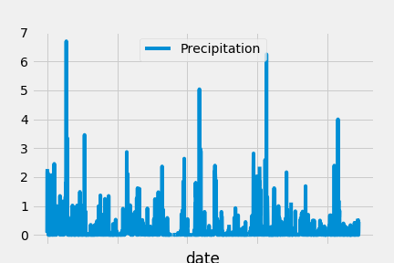
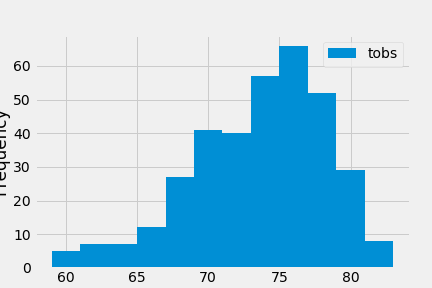
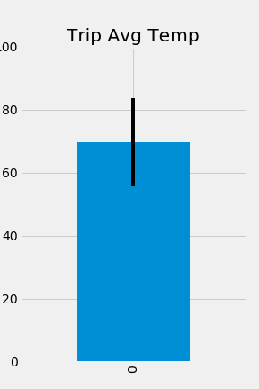
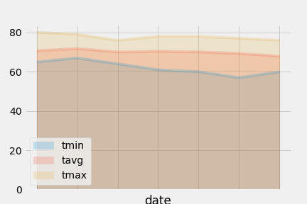

# Surf's Up!  

**Description**  
Project using Python, pandas, matplotlib, SQLAlchemy, and Flask to perform a basic climate analysis and data exploration of a SQLite climate database.  

A query was used to retrieve the last 12 months of precipitation data from the database.  This was loaded into a pandas DataFrame, sorted by date, and plotted using matplotlib.  

  

----  

A query was used to retrieve the last 12 months of temperature data, filtered by the station with the most observations.  The resulting data was then plotted as a histogram showing the distribution of temperature observations.  

 

----  

A Flask app route was used to return the temperatures for a given date range (one year prior to the planned trip), and the average, min, and max temperatures were plotted.  

  

----  

A Flask app route was used to return the absolute min, max, and average temperature for all previous years matching the month and days of the planned trip.  The resulting data was then plotted.   

  